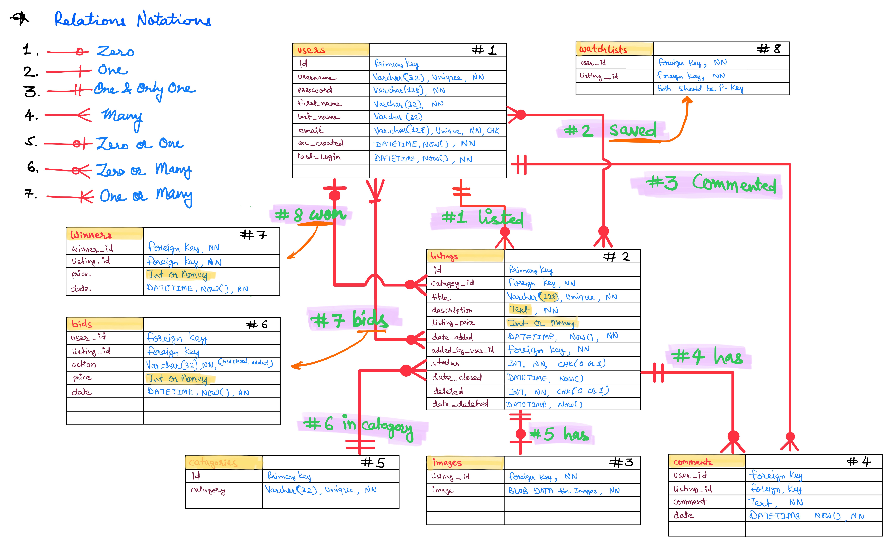

# Design Document

By RINKESH PATEL

Video overview: [Click here](https://youtu.be/GmjcKuE2OJY)

## Scope

This database is for e-commerce auction site. I am doing CS50web course and currently working on project 2 (Commerce) where I need to design an entire database for auction site.
This database design will be my blueprint for the CS50web project 2 database.

This database includes two types of users, one who wants to sell something (sellers) and others who are looking to buy something (potential buyers).

Detailed information included in the database's scope:

1. **Users:** There are two types of users, sellers and buyers. User can be both. All the information related to use such as username, first name, last name etc are included in this table.
2. **Categories:** It contains all the categories which can be further used while creating a new listing.
3. **Listings:** All the information related to listings such as title, description, price etc are stored in this table.
4. **Images:** If a listing has images it will be storred in this table.
5. **Comments:** Any comments on listings will be storred in this table.
6. **Bids:** Any new bids on any listings will be stored in this table. It will keep track of all the bids on listings.
7. **Winners:** Once listing is closed by seller, a trigger will automatically check the max bid price for the listing and record the user as a winner.
8. **Watchlists:** If any user wants to add any listing to watchlists, this table will keep track of users' watchlists.

This is not a normal e-commerce site where sellers sells products with fixed price. Sellers who want to sell products only with fixed price and buyers who want to buy products for a fixed price are outside the scope of this database or platform. Expiration time of listings is also excluded.

## Functional Requirements

Unlike traditional e-commerce, this is an auction e-commerce site where sellers can list any product with title, description, image/s and listing price. Once new listing is up, potential buyers will be able to bid on it. All the related information will be stored in appropriate table of this database.

As a security measures, users won't be able to access, modify or delete any information which are not related them. For example, only sellers have ability to modify information related to their listed listings.

## Representation

### Entities

#### 1. Users

The `Users` table includes:

1. `id` is the number based `PRIMARY KEY` for the `users` table and it is why the `INTEGER` data type used. `AUTOINCREMENT` will keep automatically incrementing the `id` numbers.

2. `username` will contains usernames and must not be longer than 32 characters `VARCHAR(32)`. It must be unique and not empty, therfor `UNIQUE` and `NOT NULL` constraints are used.

3. `password` will be stored as encrypted with no longer than 128 characters which is `VARCHAR(128)`. It should be `NOT NULL`.

4. `first_name` is first name of users and must not exceed `VARCHAR(32)` and `NOT NULL` constraint used since it must not be empty.

5. `last_name` can be empty but must not exceed `VARCHAR(32)`.

6. `email` must be unique, not be empty and not exceed 128 characters. `VARCHAR(128)` is the datatype used while `NOT NULL` and `UNIQUE` contraints are used.

7. `acc_created` will store date and time the account created. To store date and time, `DATETIME` data type is used. It must `NOT NULL`. To record accurate time, `NT_TIMESTAMP` function is used.

8. `last_login` will keep track of date and time user last logged in. `DATETIME` data type is used. Similar to `acc_created`, it must `NOT NULL` and to record accurate date and time, `CURRENT_TIMESTAMP` function is used.

#### 2. Categories

The `categories` table includes:

1. `id` is the number based `PRIMARY KEY` and it is why the `INTEGER` data type used. `AUTOINCREMENT` will keep automatically incrementing the `id` numbers.

2. `category` lists all the categories, `VARCHAR(32)` datatype is enough. Every category must be `UNIQUE`. User cannot enter new data without category, therefor `NOT NULL` constraint is used.

#### 3. Listings

The `Listings` table includes:

1. `id` is the number based `PRIMARY KEY` and it is why the `INTEGER` data type used. `AUTOINCREMENT` will keep automatically incrementing the `id` numbers.

2. `category_id` represents the `id` of the category as `INTERGER` and must be `NOT NULL`. This column is `FOREIGN KEY` which references the `id` of `categories` table.

3. `title` column will store the titles of listings, it must be `UNIQUE` and `NOT NULL`. The `VARCHAR(255)` datatype is used since it must not exceed 128 characters.

4. `description` will store the descriptions of listings and since it can be very long, `TEXT` datatype is used with `NOT NULL` constraints.

5. `listing_price` is the listing price set by sellers for the first time. It should `NOT NULL` and `DECIMAL(5, 2)` datatype is used to represent money, it will also make sure that the price cannot be more than 999.99 for security reasons. `CHECK("listing_price" > 0)` will make sure the `listing_price` must be greater than zero.

6. `datetime_added` will store date and time the listing created. To store date and time, `DATETIME` data type is used. It must `NOT NULL`. To record accurate date and time, `CURRENT_TIMESTAMP` function is used.

7. `added_by_user_id` represents the `id` of the user as `INTERGER` and must be `NOT NULL`. This column is `FOREIGN KEY` which references the `id` of `users` table.

8. `status` will keep record either the listing is active or not, must be `NOT NULL`. `ENUM('active', 'closed', 'deleted')` will ensure the the listing `status` must be either `active`, `closed` or `deleted`, by default it is `active`.

#### 4. Images

The `Images` table includes:

1. `listing_id` represents the `id` of the listing as `INTERGER` and must be `NOT NULL`. This column is `FOREIGN KEY` which references the `id` of `listings` table. It is also a `PRIMARY KEY` since list can have only one image.

2. `image` stores stores binary data of image. `BLOB` datatype is used to store image binary data and it should not be empty, `NOT NULL`.

#### 5. Comments

The `Comments` table includes:

1. `user_id` represents the `id` of the user as `INTERGER` and must be `NOT NULL`. This column is `FOREIGN KEY` which references the `id` of `users` table.

2. `listing_id` represents the `id` of the listing as `INTERGER` and must be `NOT NULL`. This column is `FOREIGN KEY` which references the `id` of `listings` table.

3. `comment` will store comments which can be very long, therefor `TEXT` datatype is used with `NOT NULL` constraints.

4. `timestamp` will store date and time the comment posted. To store date and time, `DATETIME` data type is used. It must `NOT NULL`. To record accurate date and time, `CURRENT_TIMESTAMP` function is used.

#### 6. Bids

The `Bids` table includes:

1. `id` is the number based `PRIMARY KEY` and it is why the `INTEGER` data type used. `AUTOINCREMENT` will keep automatically incrementing the `id` numbers.

2. `user_id` represents the `id` of the user as `INTERGER` and must be `NOT NULL`. This column is `FOREIGN KEY` which references the `id` of `users` table.

3. `listing_id` represents the `id` of the listing as `INTERGER` and must be `NOT NULL`. This column is `FOREIGN KEY` which references the `id` of `listings` table.

4. `action` must not be empty, `NOT NULL`. The action must be one from <i>added</i> or <i>bid_placed</i> and `ENUM('added', 'bid_placed')` will ensure it.

5. `price` is the bidding amount, initially set by sellers for the first time and then by potential buyers. It should `NOT NULL` and `DECIMAL(5, 2)` datatype is used to represent floating number as money. `CHECK(`price` > 0)` will make sure the `listing_price` must be greater than zero.

6. `timestamp` will store date and time of new entry in the table. To store date and time, `DATETIME` data type is used. It must `NOT NULL`. To record accurate date and time, `CURRENT_TIMESTAMP` function is used.

#### 7. Winners

The `Winners` table includes:

1. `listing_id` represents the `id` of the listing as `INTERGER` and must be `NOT NULL`. This column is `FOREIGN KEY` which references the `id` of `listings` table.

2. `user_id` represents the `id` of the user as `INTERGER` and must be `NOT NULL`. This column is `FOREIGN KEY` which references the `id` of `users` table.

3. `timestamp` will store date and time of winner of the listing. To store date and time, `DATETIME` data type is used. It must `NOT NULL`. To record accurate date and time, `CURRENT_TIMESTAMP` function is used.

#### 8. Watchlists

The `Watchlists` table includes:

1. `user_id` represents the `id` of the user as `INTERGER` and must be `NOT NULL`. This column is `FOREIGN KEY` which references the `id` of `users` table.

2. `listing_id` represents the `id` of the listing as `INTERGER` and must be `NOT NULL`. This column is `FOREIGN KEY` which references the `id` of `listings` table.

### Relationships

The diagram image below describes the relationships between the entities in the database.

Description of every relations illustrated in the diagram image above:

<i>Note: numbers in green represents relation number, while in black represents table number.</i>

1. A user can add zero or multiple listings.
2. A user can add zero or multiple listings to their watchlist and a listing can be added by multiple users.
3. A user can comment single time or multiple times on any listings but a comment can be posted by one and only one user on one and only one listing at a time.
4. A listing can have zero or multiple comments, but a comment can be posted on one and only one listing at a time.
5. A listing can have zero or one image but an image must be associated to one and only one listing.
6. A listing must have one and only one category but a category can be added in zero or multiple listings.
7. A user can add bid to zero or multiple listings, while a listing must have atleast one (initial price) or multiple bids.
8. A user can be winner of zero or multiple listings, while a listing can have zero or only one winner.

## Optimizations

### VIEWS
- As of now no views are created, but it will be created based on requirement once the platform will be in testing stage.

### INDEXES
- `find_listings_title` will speed up the loading of listings titles.
- `find_listings_category` will speed up the loading of listings based on `category_id`.
- `find_listings_status` will speed up the loading of listings based on `status`.
- `bid_by_listings` will speed up the loading bids by `listing_id`.
- `bid_by_price` will speed up the loading bids by `price`.

### TRIGGERS
1. Add listing price to `bids` table for the first time with `added` action.
2. Adding winner in `winners` table when listing is closed by the user.

## Limitations

### 1. Timer based listings
- This design does not support timer based listing. Timer based listing means any user can add an expiry time when the listing will automatically be closed and winner will be assigned.

### 2. Single image per listing
- This design only supports one image per listing but it can be scaled based on future requirements.
